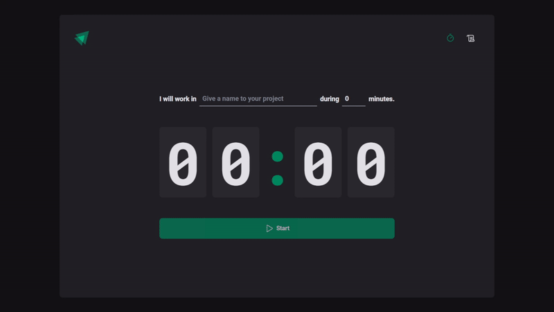

<p align="center">
  
</p>

# [Pomodoro Timer](https://pomodoro-timer-legeannd.vercel.app/)
     

<p align="center">
  
</p>


* [Content (en-US)](#section-en_us)
* [Conteúdo (pt-BR)](#secao-pt_br)

---

## About the project <a id="section-en_us"></a>

This is a pomodoro timer app made in React and Typescript where the user can create a new countdown to work in their tasks only during the time they need to. The app saves locally all the previous tasks in addition to the finish status of each one, showing if the user has completed or interrupted a previous countdown.

## Content
  * [Techs](#techs)
  * [How to run the project](#installation)
    * [Installation - Frontend](#installation-front)

## Techs <a id="techs"></a>

- [x] React Router DOM
- [x] React Hook Form
- [x] Immer
- [x] Styled Components

## How to execute the project <a id="installation"></a>
To execute the project, you'll need to have Node and NPM or Yarn installed to setup all the dependencies.


### Installation - Front-end (Web) <a id="installation-front"></a>

In the project root folder:

```bash
npm install
npm run dev
```

If you are using Yarn, use this:
```bash
yarn install
yarn dev
```

<!-- Remember to create a .env file to put the enviroment variables exemplified in the .env.example file with your personal data. -->

After finishing installation, the web page will be open in your browser.

---

## Sobre o projeto <a id="secao-pt_br"></a>

Este é um aplicativo de timer pomodoro feito em React e Typescript onde o usuário pode criar uma nova contagem regressiva para trabalhar em suas tarefas apenas durante o tempo que precisar. O aplicativo salva localmente todas as tarefas anteriores, além do status de conclusão de cada uma, mostrando se o usuário concluiu ou interrompeu uma contagem regressiva anterior.

## Conteúdos
  * [Tecnologias](#tecnlogias)
  * [Como executar o projeto](#instalacao)
    * [Instalação - Front-end](#instalacao-front)

## Tecnologias <a id="tecnologias"></a>

- [x] React Router DOM
- [x] React Hook Form
- [x] Immer
- [x] Styled Components

## Como executar o projeto <a id="instalacao"></a>
Para executar o projeto, você irá precisar ter o Node e o NPM ou Yarn instalados para baixar as dependências.


### Instalação - Front-end (Web) <a id="instalacao-front"></a>

Na pasta raíz do repositório:

```bash
npm install
npm run dev
```

Se estiver usando Yarn, utilize
```bash
yarn install
yarn dev
```

<!-- Lembre-se de criar um arquivo .env para colocar as variáveis de ambiente exemplificadas no arquivo .env.example com os seus dados pessoais. -->

Quando terminar, a página da aplicação web será aberta no navegador.

---
###### Developed by [Gean Lucas](https://www.linkedin.com/in/geanlucaas/) :rocket:.